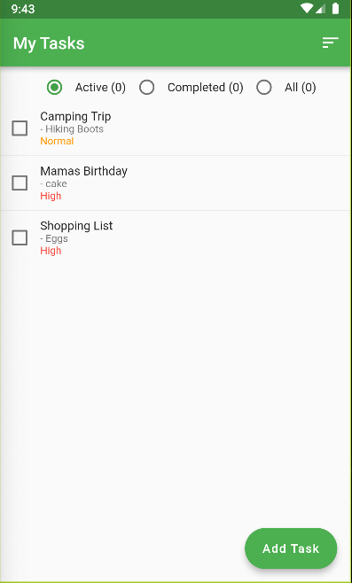

### Rocket Todo

See [demo video](https://drive.google.com/file/d/1AdEcuuzlwFHJ3Q_2ZD0L_LHo-6OB8hak/view) for guide

---
A simple app that:
-  Add and view tasks
-  Delete a task
-  Complete a task
-  Set a priority for my tasks
-  View the tasks sorted by priority and name
-  View the number of total and completed tasks

### Requirements
- [Flutter  3.x.x](https://flutter.dev/)
- [Android Studio](https://developer.android.com/studio)
- [Xcode](https://developer.apple.com/xcode//)
